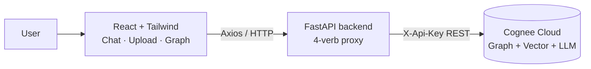

# 🧠 LifeOS — Your AI That Never Forgets

> *Piece together every decision, email, and meeting across infinite sessions.*

LifeOS is a **Personal AI Memory Vault**. Feed it your emails, notes, and calendars, then ask it anything — it answers by traversing a knowledge **graph** it builds from your data, so it connects facts across sources the way you never could from memory alone.

Built for the **"Hangover Part AI"** hackathon (theme: *"Your AI woke up in Vegas with no memory… build AI that doesn't forget"*) on top of **[Cognee](https://cognee.ai)** — the open-source memory engine for AI.

---

## ✨ The four memory operations

LifeOS demonstrates Cognee's full memory lifecycle end-to-end:

| Verb | What it does | In LifeOS |
|------|--------------|-----------|
| **remember** | Ingest data and build a graph | Upload text / files / calendars |
| **recall** | Query with graph + vector routing | Chat with cited sources |
| **improve** | Re-enrich & deduplicate the graph | "✨ Improve" button — memory gets sharper live |
| **forget** | Surgically delete memories | 🗑 per-dataset delete |

The showcase moment: add a new email mid-demo, hit **Improve**, and watch LifeOS answer a question it *couldn't* answer moments before — the graph updates in real time.

---

## 🏗️ Architecture



- **Frontend:** Vite + React + Tailwind + Axios + D3 (memory graph)
- **Backend:** FastAPI — a thin, typed proxy. All Cognee access funnels through one module (`cognee_client.py`) exposing `remember` / `recall` / `improve` / `forget`.
- **Memory:** Cognee Cloud (hosted graph + vector store + LLM). No local database or OpenAI key needed.

---

## 🚀 Run it locally

### 1. Backend

```bash
cd backend
python -m venv venv
venv/Scripts/python.exe -m pip install -r requirements.txt   # Windows
# source venv/bin/activate && pip install -r requirements.txt  # macOS/Linux
```

Create `.env.local` in the **project root** (copy from `.env.example`):

```ini
API-Base-URL=https://your-tenant.aws.cognee.ai
API-KEY=your-cognee-api-key
```

Start the API:

```bash
cd backend
venv/Scripts/python.exe -m uvicorn main:app --reload --port 8000
```

### 2. Preload the demo story (optional but recommended)

```bash
cd backend
venv/Scripts/python.exe preload_demo.py
```

### 3. Frontend

```bash
cd frontend
npm install
npm run dev
```

Open **http://localhost:5173**.

---

## 🔌 API

| Method | Endpoint | Purpose |
|--------|----------|---------|
| POST | `/ingest/text` | remember raw text |
| POST | `/ingest/file` | remember an uploaded file (PDF/TXT/MD/CSV/JSON/DOCX) |
| POST | `/ingest/calendar` | remember ICS calendar events |
| POST | `/query` | recall — returns `{answer, sources[]}` (+ optional graph) |
| POST | `/improve` | improve — re-enrich the graph |
| DELETE | `/forget/{name}` | forget a dataset |
| GET | `/datasets` | list memory vaults |
| GET | `/health` | tenant connectivity |

---

## 🎬 Demo

See **[DEMO.md](DEMO.md)** for the full 2-minute script. The demo data (`demo_data/`) tells a cohesive product-team story — a Q3 marketing-budget decision across 5 emails, 2 calendar events, and 2 meeting notes — so recall can answer genuine **multi-hop** questions:

- *"What was the final agreed marketing budget?"* → **$45k** (inferred across emails)
- *"Who was responsible for influencer campaigns?"* → **Bob**
- *"Where was the budget meeting held?"* → **Room 4B**
- *"What were my action items from the sprint retro?"* → **follow up on the influencer contract**

---

## 🧩 Why it matters

Your context lives scattered across inboxes, docs, and calendars. LLMs forget everything between sessions. LifeOS gives your AI a **persistent, self-improving memory** — so it wakes up in the meeting *with* the context, not without it.

Built with ❤️ on open-source [Cognee](https://github.com/topoteretes/cognee).
