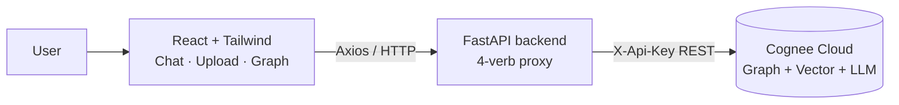

# 🧠 LifeOS - Your AI That Never Forgets

> *Piece together every decision, email, and meeting across infinite sessions.*

LifeOS is a **Personal AI Memory Vault**. Feed it your emails, notes, and calendars, then ask it anything - it answers by traversing a knowledge **graph** it builds from your data, so it connects facts across sources the way you never could from memory alone.

Built for the **"Hangover Part AI"** hackathon (theme: *"Your AI woke up in Vegas with no memory… build AI that doesn't forget"*) on top of **[Cognee](https://cognee.ai)** - the open-source memory engine for AI.

---

## ✨ The four memory operations

LifeOS demonstrates Cognee's full memory lifecycle end-to-end:

| Verb | What it does | In LifeOS |
|------|--------------|-----------|
| **remember** | Ingest data and build a graph | Upload text / files / calendars |
| **recall** | Query with graph + vector routing | Chat with cited sources |
| **improve** | Re-enrich & deduplicate the graph | "✨ Improve" button - memory gets sharper live |
| **forget** | Surgically delete memories | 🗑 per-dataset delete |

The showcase moment: add a new email mid-demo, hit **Improve**, and watch LifeOS answer a question it *couldn't* answer moments before - the graph updates in real time.

---

## 🏗️ Architecture



- **Frontend:** Vite + React + Tailwind + Axios + D3 (memory graph)
- **Backend:** FastAPI - a thin, typed proxy. All Cognee access funnels through one module (`cognee_client.py`) exposing `remember` / `recall` / `improve` / `forget`.
- **Memory:** Cognee Cloud (hosted graph + vector store + LLM). No local database or OpenAI key needed.

---

## 🚀 Run it locally

### 1. Backend

```bash
cd backend
python -m venv venv
venv/Scripts/python.exe -m pip install -r requirements.txt   # Windows
# source venv/bin/activate && pip install -r requirements.txt  # macOS/Linux
```

Create `.env.local` in the **project root** (copy from `.env.example`):

```ini
API-Base-URL=https://your-tenant.aws.cognee.ai
API-KEY=your-cognee-api-key
```

Start the API:

```bash
cd backend
venv/Scripts/python.exe -m uvicorn main:app --reload --port 8000
```

### 2. Preload the demo story (optional but recommended)

```bash
cd backend
venv/Scripts/python.exe preload_demo.py
```

### 3. Frontend

```bash
cd frontend
npm install
npm run dev
```

Open **http://localhost:5173**.

---

## 🔌 API

| Method | Endpoint | Purpose |
|--------|----------|---------|
| POST | `/ingest/text` | remember raw text |
| POST | `/ingest/file` | remember an uploaded file (PDF/TXT/MD/CSV/JSON/DOCX) |
| POST | `/ingest/calendar` | remember ICS calendar events |
| POST | `/query` | recall - returns `{answer, sources[]}` (+ optional graph) |
| POST | `/improve` | improve - re-enrich the graph |
| DELETE | `/forget/{name}` | forget a dataset |
| GET | `/datasets` | list memory vaults |
| GET | `/health` | tenant connectivity |
| GET | `/people` `/timeline` `/graph` | dynamic insights extracted from real memories |
| GET | `/connectors` | connection status of each account |
| GET | `/auth/{provider}/login` · `/callback` | OAuth connect (google/notion/slack) |

---

## 🔗 Connect your Gmail (real email ingestion)

LifeOS can read your real emails (and Calendar + Drive) over Google OAuth, so you don't paste anything - connect once and ask.

**One-time Google setup (~10 min):**
1. **https://console.cloud.google.com** → new project → **APIs & Services → Library** → enable **Gmail API**, **Google Calendar API**, **Google Drive API**.
2. **OAuth consent screen** → **External** → add app name + emails → add scopes `gmail.readonly`, `calendar.readonly`, `drive.readonly` → **Publish App** (Production, so anyone can connect; no test-user list).
3. **Credentials → Create → OAuth client ID → Web application** → Authorized redirect URI `http://localhost:8000/auth/google/callback` → copy Client ID + Secret.
4. Put them in `.env.local`:
   ```ini
   GOOGLE_CLIENT_ID=...apps.googleusercontent.com
   GOOGLE_CLIENT_SECRET=...
   GOOGLE_REDIRECT_URI=http://localhost:8000/auth/google/callback
   ```
5. Restart the backend, open the app, click **Connect Gmail** → Google consent → your recent emails are ingested and instantly queryable.

*(Notion and Slack work the same way with their own optional `NOTION_*` / `SLACK_*` credentials, see `.env.example`. Apple Notes has no public API, so its card imports a file instead.)*

---

## ☁️ Deploy (frontend on Vercel, backend on Railway)

**Live:** frontend https://life-os-facing.vercel.app · backend https://lifeos-backend-production-f27e.up.railway.app

The React frontend is static (Vercel); the FastAPI backend is a long-running server (Railway) because Cognee's cognify/search calls take tens of seconds and don't fit serverless timeouts. Everything is env-driven, so the same code runs locally and in production.

**1. Backend → Railway** (`railway.com`)
- From `backend/`: `railway init` → `railway up` → `railway domain` for a public URL. A `Procfile` (`web: uvicorn main:app --host 0.0.0.0 --port $PORT`) sets the start command. (A `render.yaml` blueprint is also included if you prefer Render.)
- Set variables: `COGNEE_BASE_URL`, `COGNEE_API_KEY`, `GOOGLE_CLIENT_ID/SECRET`, `FRONTEND_APP_URL=https://<your-vercel-app>/app`, `CORS_ORIGINS=https://<your-vercel-app>`, and the redirect URIs **pointing at the backend URL**, e.g. `GOOGLE_REDIRECT_URI=https://<your-backend>.up.railway.app/auth/google/callback`.

**2. Update the OAuth consoles**
- In Google (and Notion/Slack), set the **Authorized redirect URI** to the **backend** callback URL above, byte-for-byte. This is the #1 gotcha: the provider must send the code to the backend, not the frontend.

**3. Frontend → Vercel**
- Set project env var **`VITE_API_BASE_URL=https://<your-backend>.up.railway.app`** and deploy. `frontend/vercel.json` adds the SPA rewrite so client routes like `/app` don't 404. "Connect Gmail" then flows through the backend and returns to your Vercel app.

---

## 🎬 Demo

See **[DEMO.md](DEMO.md)** for the full 2-minute script. The demo data (`demo_data/`) tells a cohesive product-team story - a Q3 marketing-budget decision across 5 emails, 2 calendar events, and 2 meeting notes - so recall can answer genuine **multi-hop** questions:

- *"What was the final agreed marketing budget?"* → **$45k** (inferred across emails)
- *"Who was responsible for influencer campaigns?"* → **Bob**
- *"Where was the budget meeting held?"* → **Room 4B**
- *"What were my action items from the sprint retro?"* → **follow up on the influencer contract**

---

## 🧩 Why it matters

Your context lives scattered across inboxes, docs, and calendars. LLMs forget everything between sessions. LifeOS gives your AI a **persistent, self-improving memory** - so it wakes up in the meeting *with* the context, not without it.

Built with ❤️ on open-source [Cognee](https://github.com/topoteretes/cognee).

---

## 🤖 AI assistance

This project was built with the help of **Claude** (Anthropic's Claude Code) as an AI pair-programming assistant, used for architecture, implementation, debugging, and deployment. All design decisions and final code were reviewed by the team.
